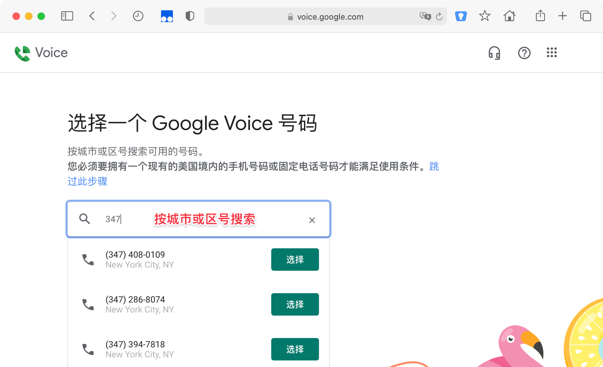
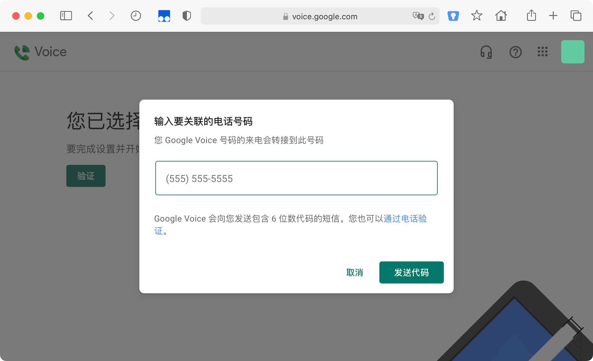
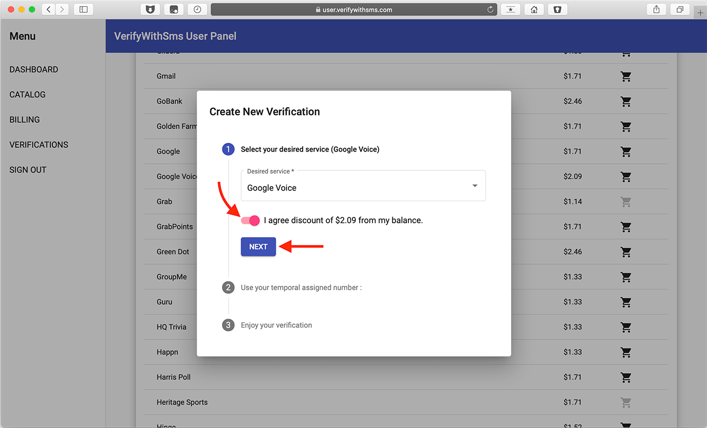
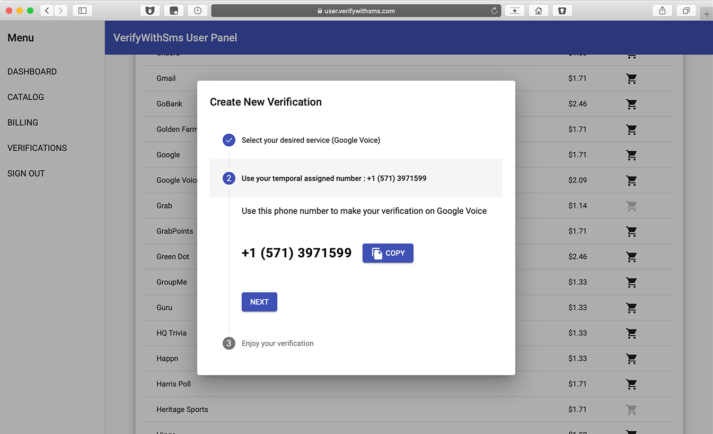
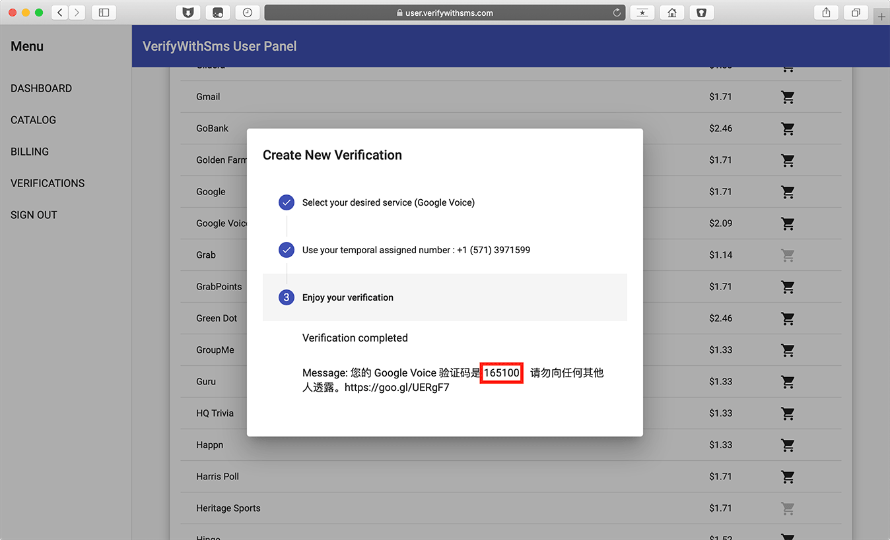
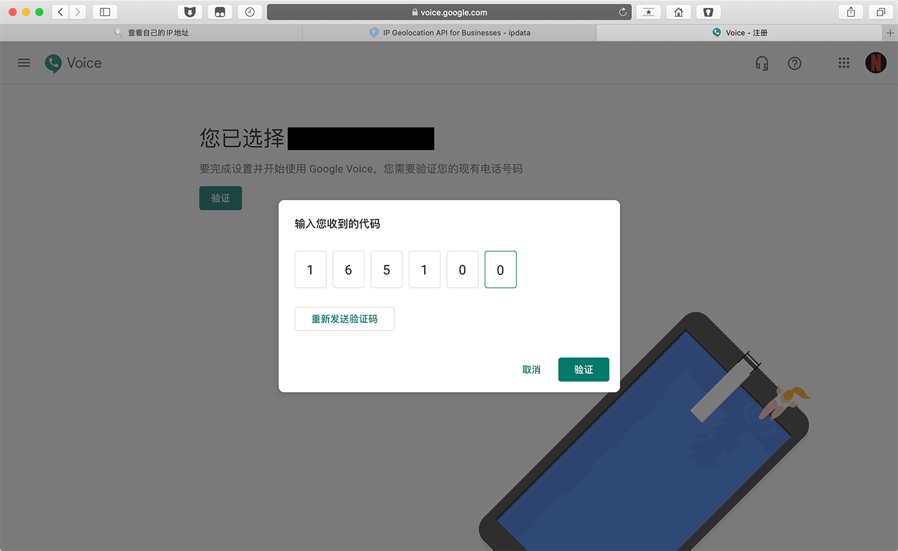
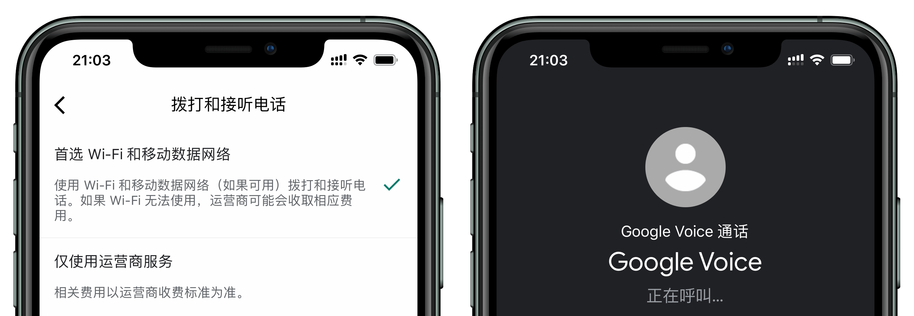

# 注册 Google Voice 方法 成功率较高

### 目录

1. [功能](#功能)
2. [检测原生 IP](#步骤一检测原生-ip)
3. [挑选 Google Voice 号码](#步骤二挑选-google-voice-号码)
4. [接码平台](#步骤三接码平台)
5. [手机上使用 Voice](#手机上使用-voice)
6. [防收回](#防收回)
7. [资费](#拨打电话非美国加拿大资费)
8. [如何充值](#如何充值)
9. [Google Voice 转移](#google-voice-转移)
10. [判断哪些号码可以注册 Google Voice](#判断哪些号码可以注册-google-voice)
11. 

### 功能

|          | 免费拨打美国，加拿大电话，收发短信                           |
| :------- | :----------------------------------------------------------- |
| 国内注册 | 爱奇艺、bilibili、抖音、京东、优酷、QQ/微信（换绑）…         |
| 国外注册 | Amazon、Facebook、PayPal、Telegram、Twitter、WhatsApp（换绑）… |

### 步骤一、检测原生 IP

节点路线为美国全局模式，浏览器无痕模式，打开  [WHOER](https://whoer.net)  检测路线伪装程度。

> 注：部分人的 IP 虽然是美国，但不是原生 IP。

### 步骤二、挑选 Google Voice 号码

2.1 打开 [Google Voice](https://voice.google.com/) 并使用 Google 账号登陆，点击页面左下角【选择电话号码】。

2.2 输入自己喜欢的数字选择一个号码。

2.3 选择号码后会提示【验证】，填入美国手机号（如没有请看[步骤三](#步骤三接码平台)）来绑定验收，点击【发送代码】。

### 步骤三、接码平台

打开 [verifywithsms](https://verifywithsms.com/) 注册登陆，点击【RECHARGE】，充值 2.35 美元（价格 / 支付方式可能存在变化）。

> **备选**：[PVA Deals](https://pvadeals.com/product/non-voip/)  接码平台，点击【Non VolP Numbers】再选择 Google Voice。

充值后点击左侧【CATALOG】，找到【Google Voice】点击右侧购物车。

勾选【I Agree】，点击【CONTINUE】。

选择 Google Voice ，打开【I agree】点击【NEXT】。

出现一个美国电话号码。

将号码填至[步骤二 2.3](#步骤二挑选-google-voice-号码) ，点击【发送代码】。

回到接收短信网页，点击【NEXT】会显示验证码。

将验证码填至[步骤二 2.3](#步骤二挑选-google-voice-号码) ，点击【验证】。

注册完成，Google Voice 号码显示在右上角。

---

### 手机上使用 Voice

* iOS：非国区 Apple ID 安装。
* Android：Google Play 里安装。

> 注：Voice 设置 > 拨打和接听电话 > 首选 Wi-Fi 和移动数据网络。

---

### 防收回

* 请勿违规，常使用，例如与朋友互相拨打电话 / 收发短信；
* 拨打美国客服电话，如 Apple，Microsoft。

>注：如果在 6 个月内没有拨打或接听电话，收发短信，[Google](https://support.google.com/voice/answer/9230450?hl=en&ref_topic=9273222) 会收回号码。不会收回已移植到 Google 语音或永久保存的号码。

---

### 拨打电话（非美国，加拿大）资费

* 中国：0.02 美元/分钟
* 更多国家/地区资费请打开 [Google Voice 通话费率](https://voice.google.com/u/0/rates?pli=1)进行查询。

---

### 如何充值？

* 方法一：打开[官网](https://voice.google.com/u/3/billing)点击【话费充值】，选择金额（可选 10/25/50 美元），填写信用卡信息购买。
* 方法二：使用 Google Voice 换绑微信后，可使用微信的 Wechat Out 充值（礼品卡）。

---

### Google Voice 转移

部分人不会注册而是在网上购买，商家会给一个 Google 账户并且 Google Voice 绑定在此号，为了避免封号等其他问题，强烈建议及时[转移](https://github.com/masonme/googlevoice-transfer)至自己的账户。

---

### 判断哪些号码可以注册 Google Voice

虚拟/固定号码无法注册 Google Voice，那么如果你使用接码平台，如何判断呢？

打开 [https://freecarrierlookup.com/](https://freecarrierlookup.com/)，输入号码，点击〔Seach〕。

* 显示 `n` 则没办法注册 Google Voice。

* 显示 `y` 则可以注册 Google Voice。

