# 2020 年最新注册 Google Voice 号码，成功率极高

### Google Voice 常用功能

|              | 免费接打美国加拿大电话和收发短信，还可以注册以下平台。       |
| :----------- | :----------------------------------------------------------- |
| 可注册`国内` | 爱奇艺、优酷、bilibili、抖音、豆瓣、知乎、京东…              |
| 可注册`国外` | PayPal、Telegram、Facebook、Twitter、Amazon、Apple ID、阿里国际… |
| 不可注册     | QQ微信（支持换绑）、WhatsApp（支持换绑）、Line、微博、百度…  |

### 声明（风险请自行承担）

* 本文只提供方案，不保证 100% 成功，只能说美国原生IP越好，成功率越高；

* 如被 Google 检测出使用代理，账号有可能被封，故 `步骤一` 很重要。

### 步骤一、检测 IP

节点切换为美国（全局模式），浏览器（无痕模式）打开 [https://whoer.net](https://whoer.net)，检测路线伪装程度。

> 注：百分比越高越好，如低于 `70%` 建议更换路线

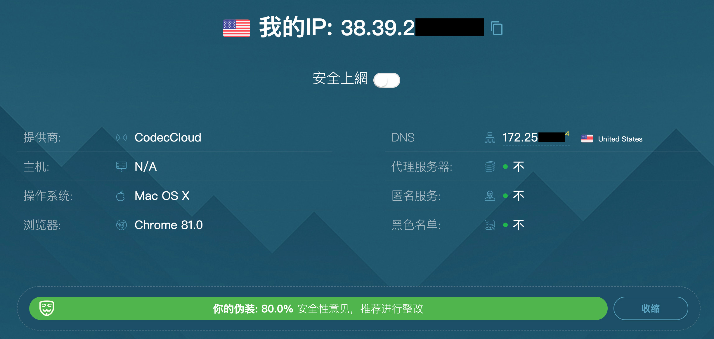

打开 [https://ipdata.co/](https://ipdata.co/)，测试路线为 `家庭` 或 `托管`。

```
type: "isp" 表示家庭用户，最佳
type: "hosting" 表示代理托管，建议更换路线
```


### 步骤二、挑选 Google Voice 号码

打开 [Google Voice](https://voice.google.com/) 并使用 Google 账号登陆，点击「选择电话号码」。

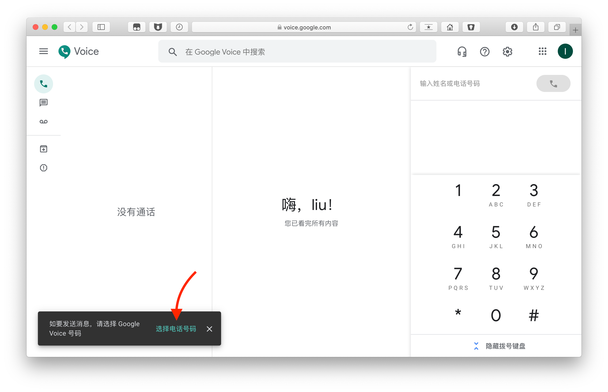

系统会推荐一些 Google Voice 号码，找到自己喜欢的点击「选择」。

> 支持输入 `区号` 或 `4位数` 搜索

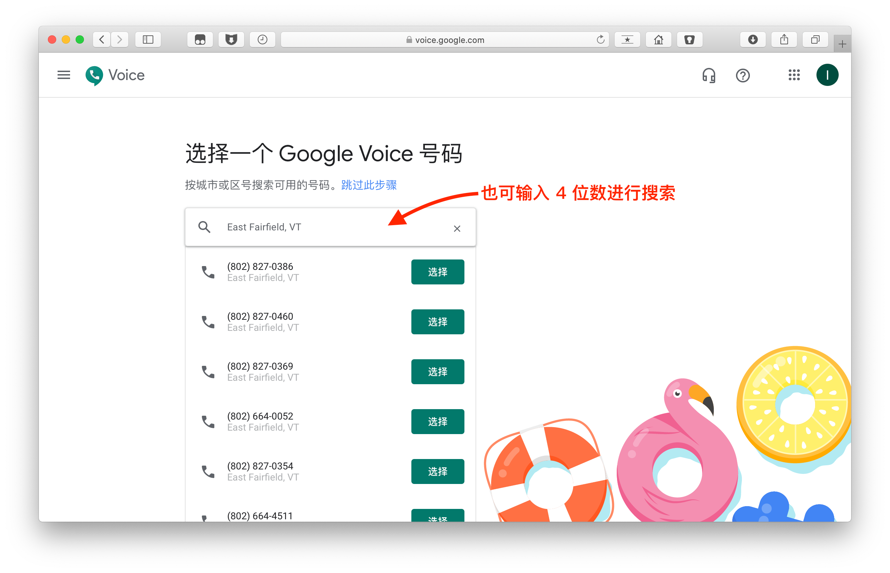

此时需填入美国手机号码，点击「发送代码」。

> 如没有手机号码，继续往下看 `步骤三`

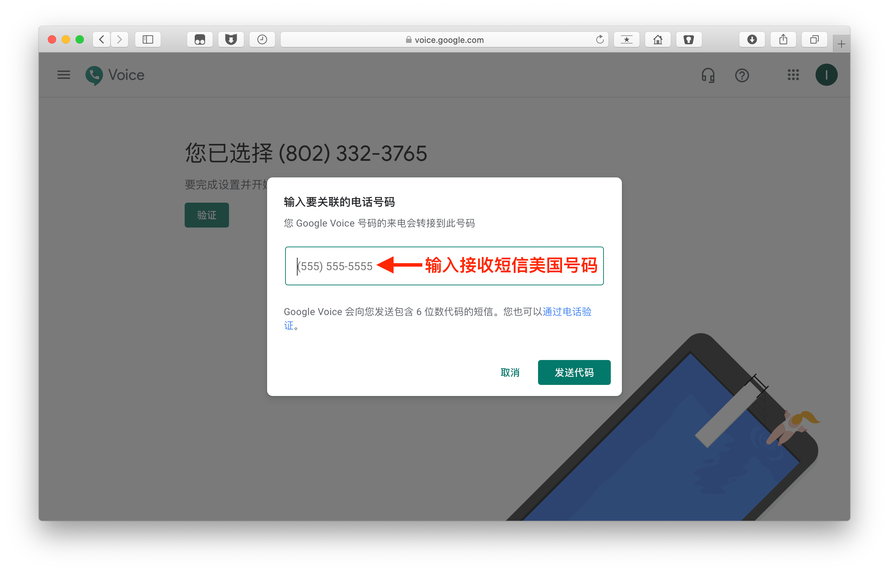

### 步骤三、代收短信

打开 [https://verifywithsms.com/](https://verifywithsms.com/)，注册并登陆。

> 注：此短信验证平台供参考，你也可以选择其他平台

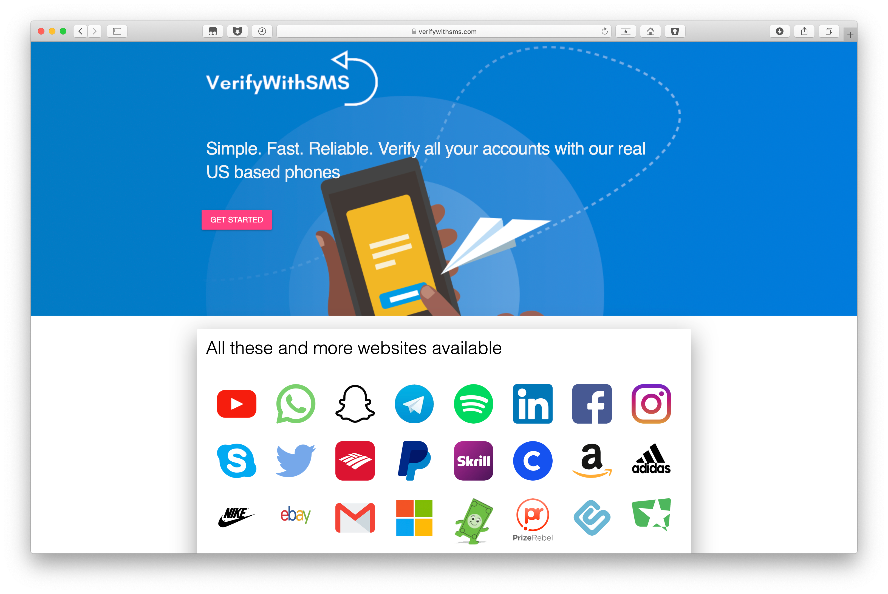

点击「RECHARGE」，选择 PayPal 支付。


充值 2.09 美元（好像不支持退款，所以不要充多）。

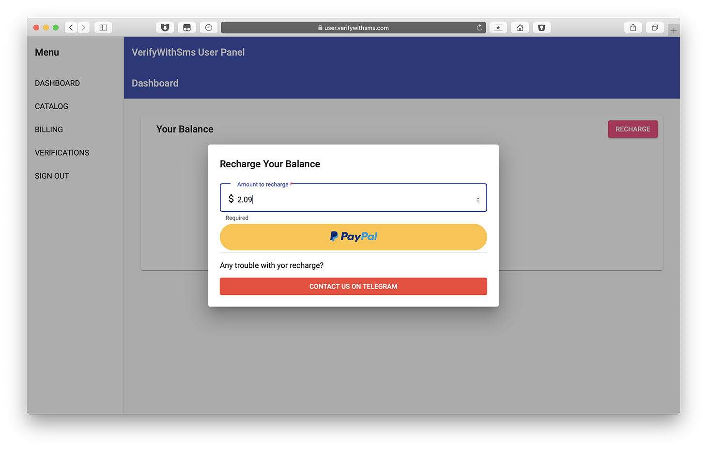

点击左侧「CATALOG」，找到「Google Voice」，点击右侧购物车。

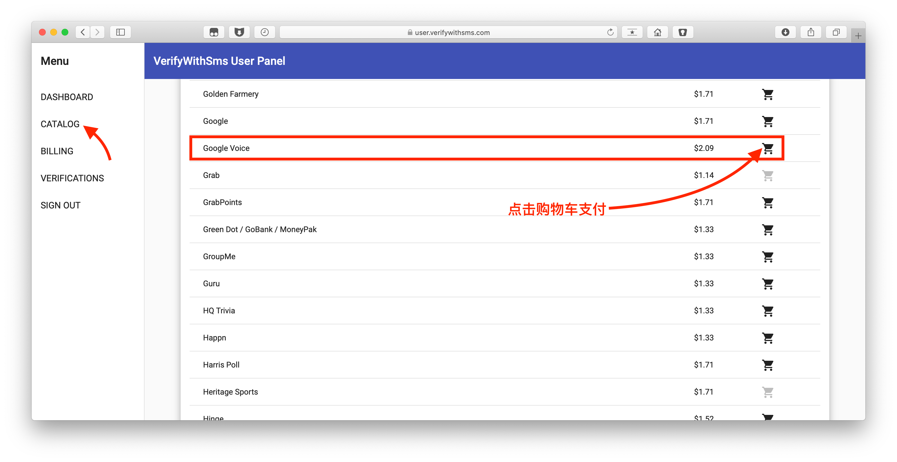

勾选「I Agree」，点击「CONTINUE」。

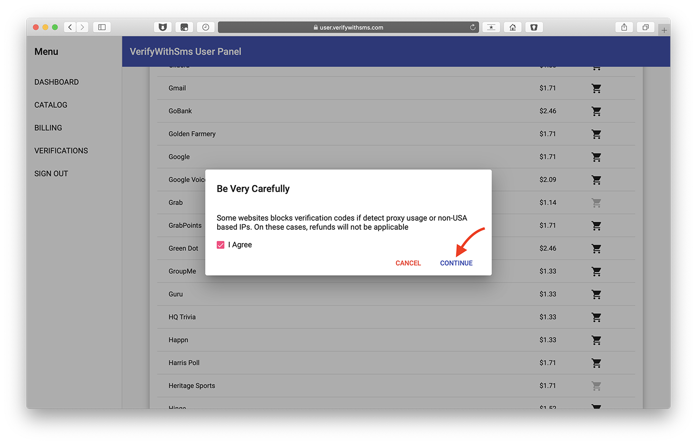

打开「我同意」，点击「NEXT」。

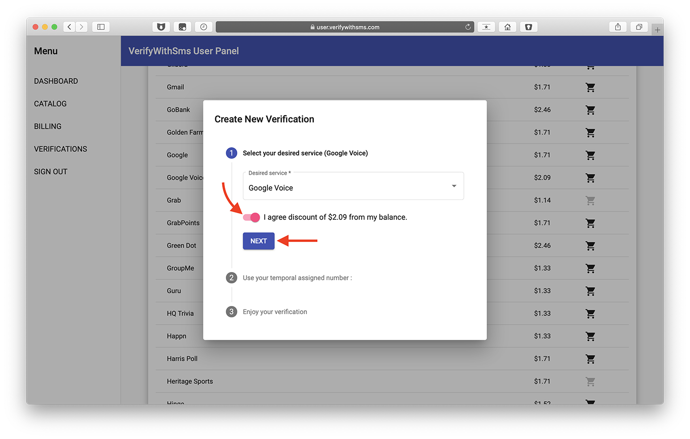

出现一个美国号码。

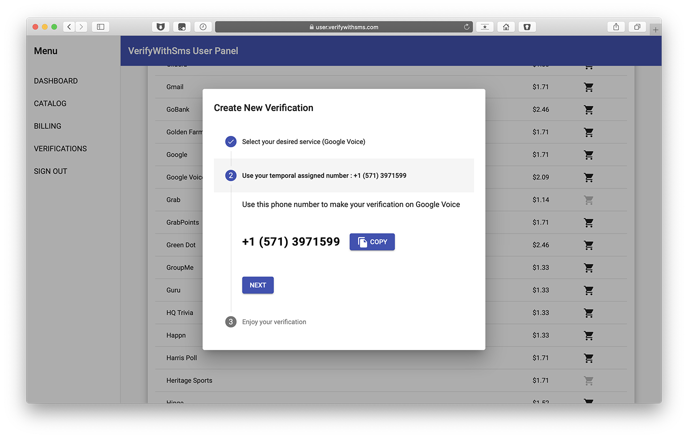

将号码填至 `步骤二` ，点击「发送代码」。

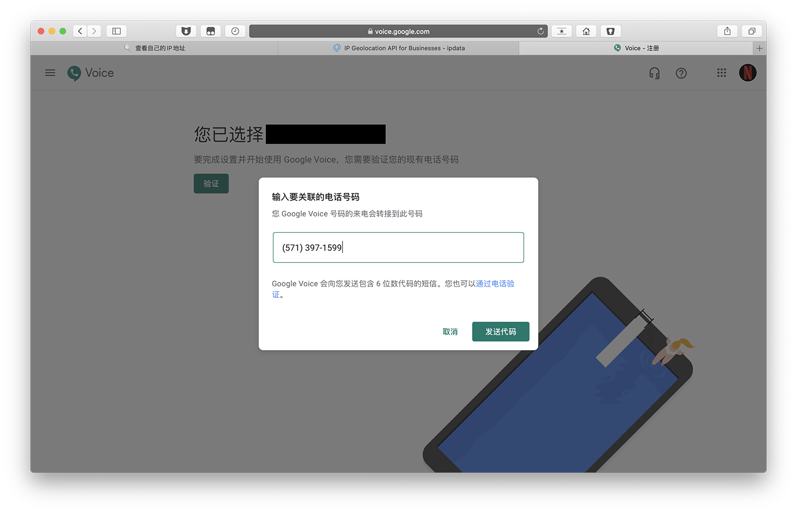

回到接收短信网站，点击「NEXT」显示验证码。

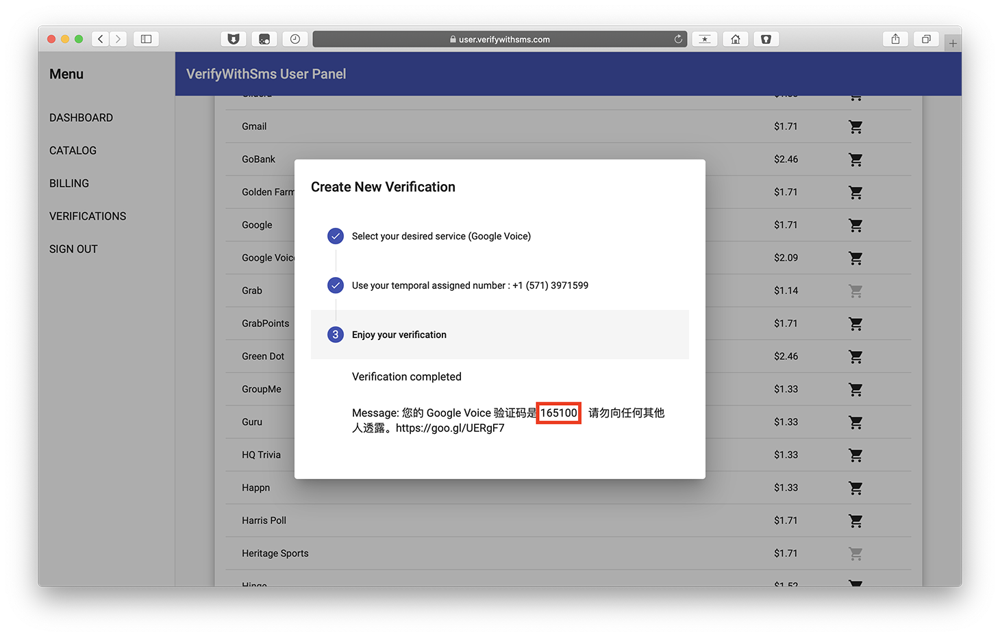

将验证码填至 `步骤二` ，点击「验证」。

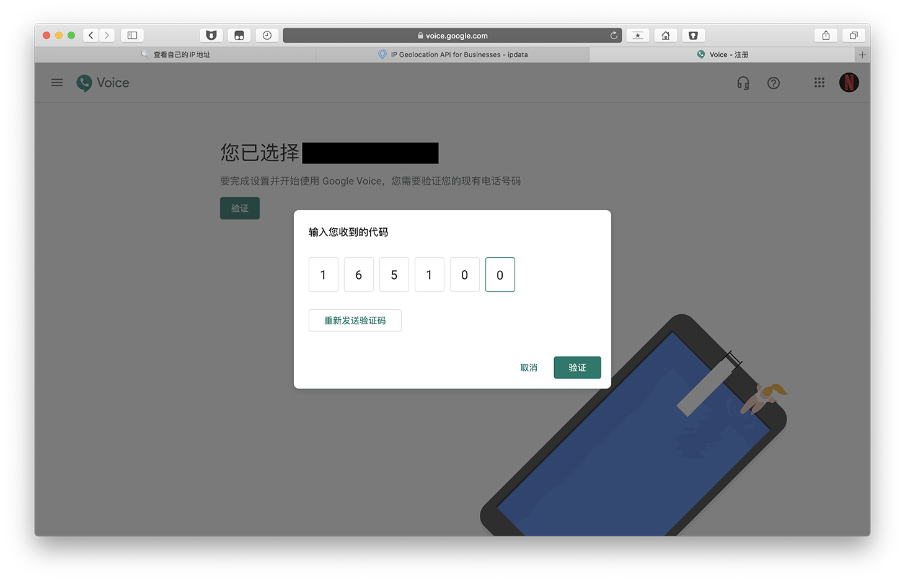

### 步骤四 注册完成

右上角号码已显示在 Google 账户下。

> 注：如未显示号码，说明注册失败，和节点有很大关系，建议更换。

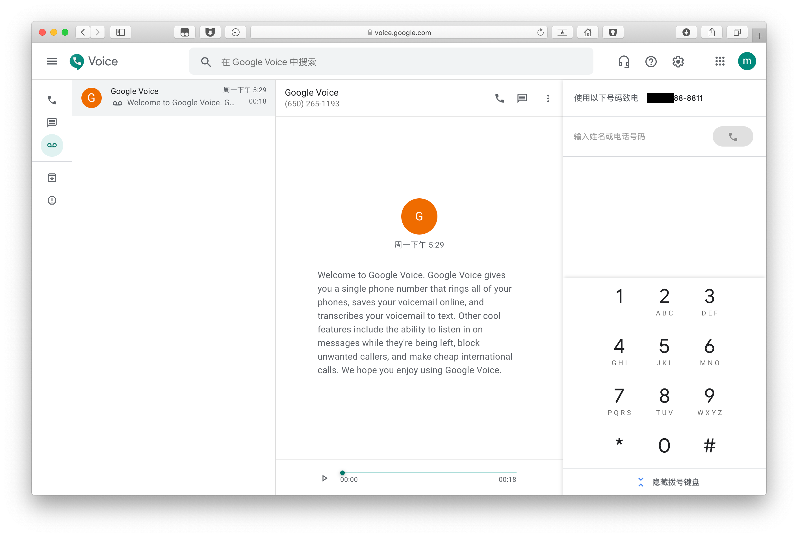

### 手机上使用环聊（推荐）

Android 手机安装环聊和环聊拨号器；iOS 手机只需要安装环聊即可。

进入环聊设置 > 电话号码，打开接到来电和消息。

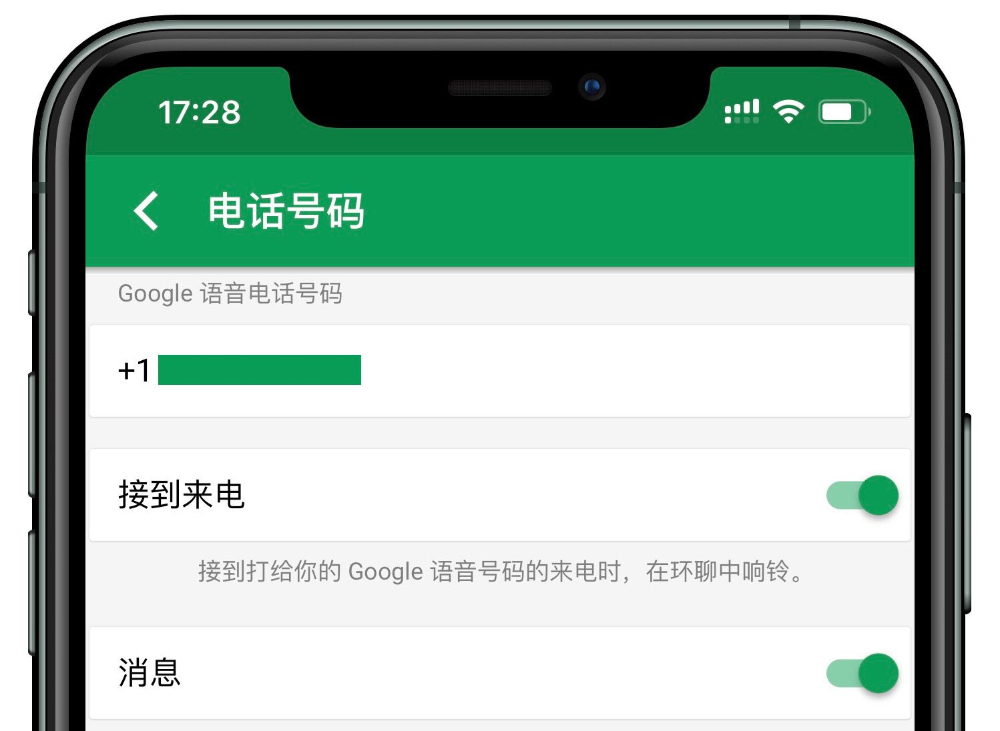

### 手机上使用 Voice

打开 Google Voice，设置 > 拨打和接听电话 > 首选 Wi-Fi 和移动数据网络。


### 如何防止 Google Voice 被收回？

9 个月内既没有拨出电话或收到来电，也没有发送或收到短信，则 Google 会收回该号码。

* 找位拥有 Google Voice 的朋友互相电话 / 短信。
* 拨打美国企业客服电话，例如 Apple，Microsoft。
* 注册多个 Google Voice 号，互相骚扰 。

### Google Voice 通话资费

* 中国-手机/有线电话：0.02美元/分钟
* 中国-香港手机/固定电话：0.03美元/分钟
* 更多国家资费介绍：[https://voice.google.com/u/0/rates?pli=1](https://voice.google.com/u/0/rates?pli=1)

----

### Telegram

* 二手路由器群：[https://t.me/ershouluyouqi](https://t.me/ershouluyouqi)
* V2EX交流群：[https://t.me/V2EXPro](https://t.me/V2EXPro)
* macOS交流群：[https://t.me/macOSjiaoliu](https://t.me/macOSjiaoliu)
* Google产品交流：[https://t.me/Googlejiaoliuqun](https://t.me/Googlejiaoliuqun)

如果对你有帮助，欢迎支付宝扫码支持！

