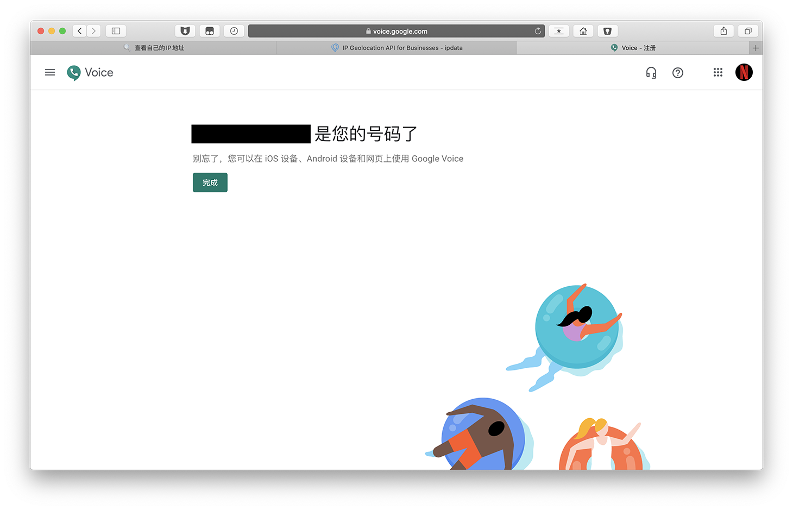
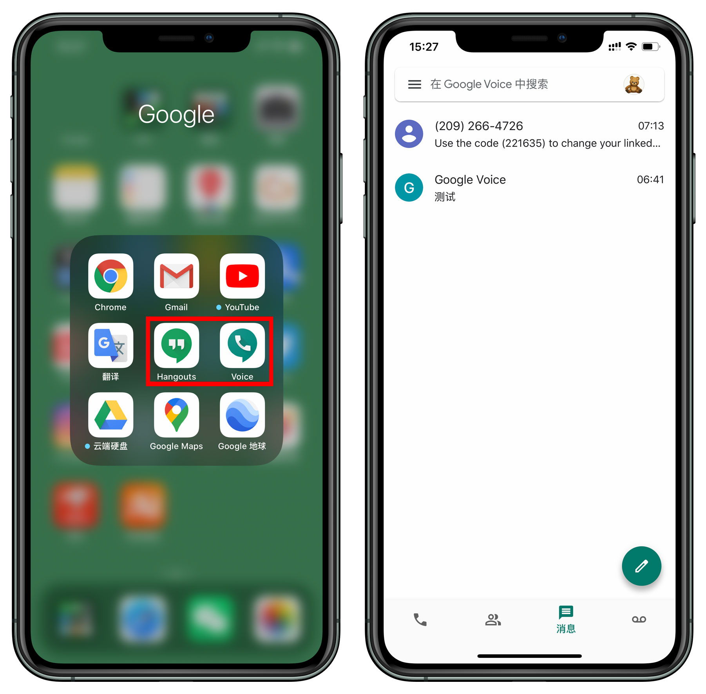
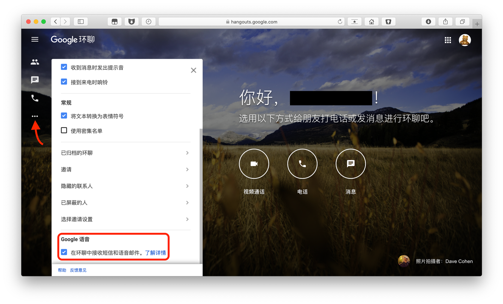
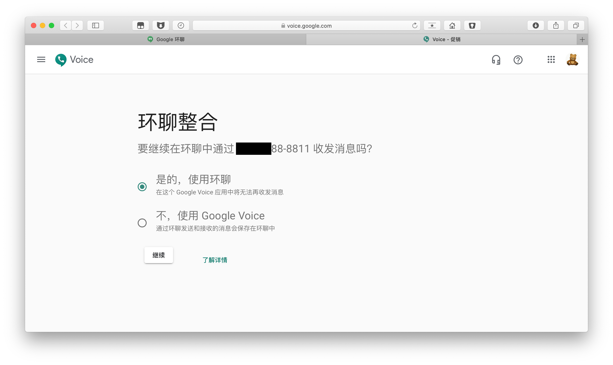
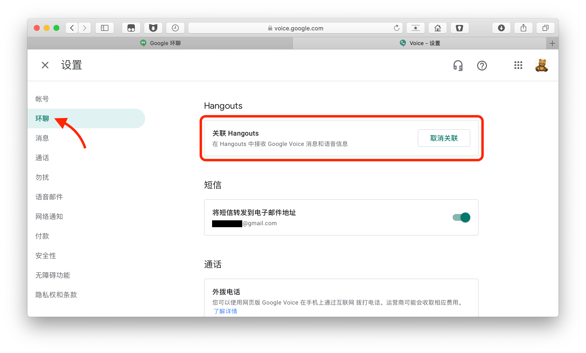
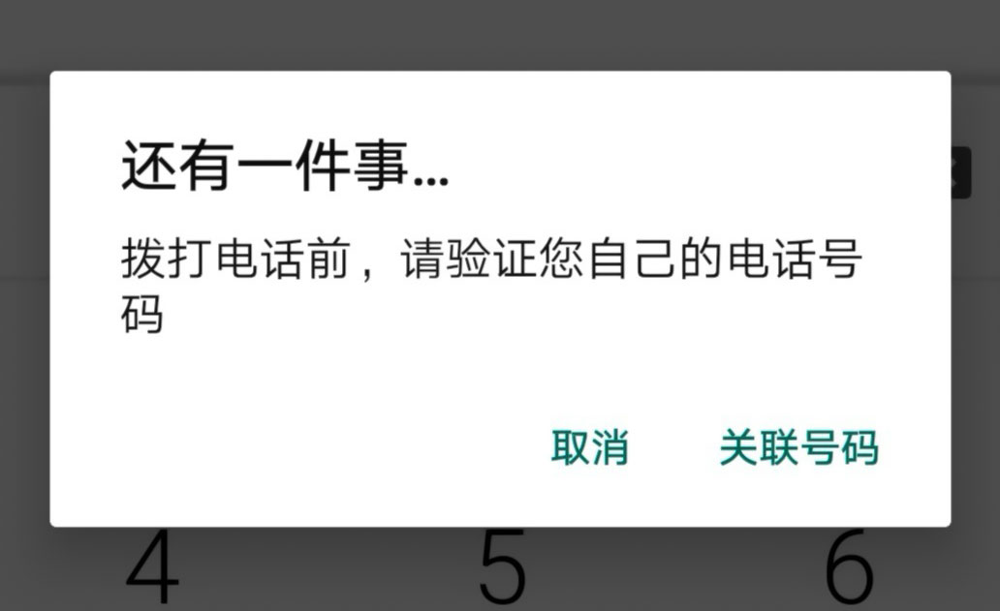
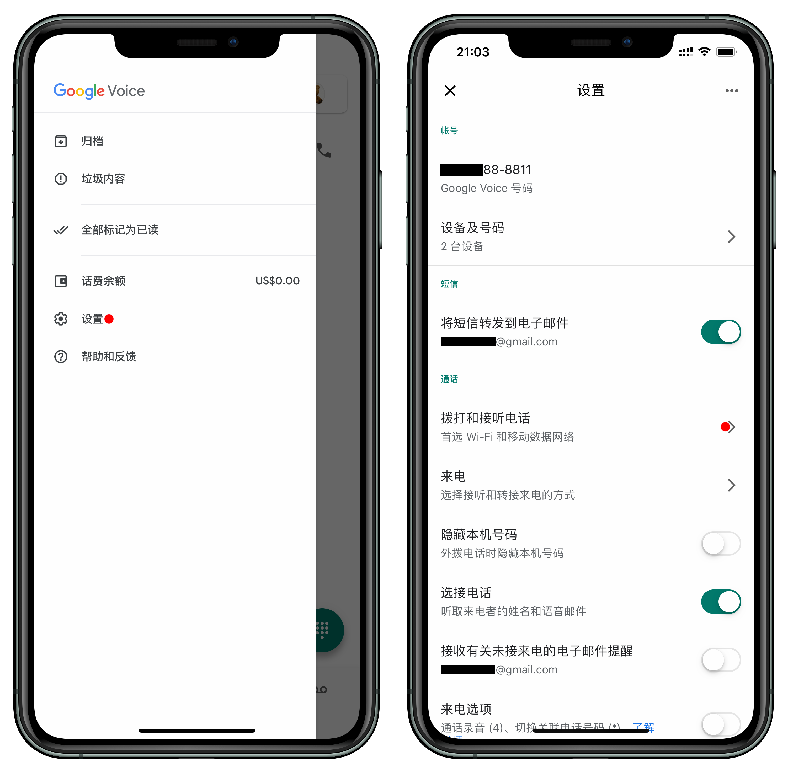
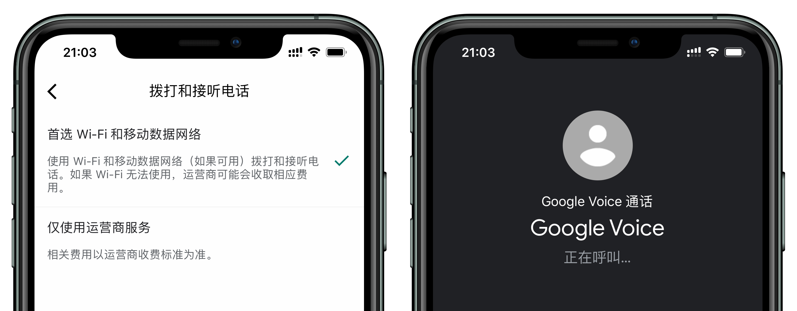

# 2020 年最新注册 Google Voice 号码，成功率极高

### Google Voice 常用功能

免费拨打 `美国` `加拿大` 电话和收发短信，除此之外，还可以注册以下平台。

|   |  平台 |
|:-:|:--|
| 国内  | 爱奇艺、优酷、bilibili、抖音、豆瓣、知乎、京东、绑定QQ、绑定微信…  |
| 国外  |  PayPal、Telegram、Facebook、Twitter、Amazon、Apple ID、阿里国际… |
| 不可注册 | WeChat、WhatsApp（支持换绑）、Line、微博、百度… |
### 准备
1. 美国原生 IP
2. 可以接收美国短信的手机卡（如没有请看 `步骤三`）

### 声明
1. 本文只提供方案，不提供美国原生 IP；如注册失败，大部分是美国原生 IP 问题；
3. 文中提供的短信验证平台供参考，你也可以选择其他平台接收短信验证码；
4. 存在的风险请自行承担，例如被 Google 检测出使用代理，账号有可能被封，故 `步骤一` 很重要。

### 步骤一、检测 IP
* 节点切换为 `美国`（全局模式）；DNS 改为 `8.8.8.8`。
* 浏览器 `无痕模式` 打开 [https://whoer.net](https://whoer.net)，检测路线是否被 Google 识别出来。
  
  > 百分比越高越好，不足地方会列出，如低于 `70%` 建议更换路线

* 打开 [https://ipdata.co/](https://ipdata.co/)，测试路线为 `家庭` 或 `托管`。

> * 显示 `type: "isp"` 表示家庭用户，最佳；
> * 显示 `type: "hosting"` 表示代理托管，建议更换路线。

### 步骤二、挑选 Google Voice 号码

* 打开 [Google Voice](https://voice.google.com/) 使用 Google 账号登陆，点击「选择电话号码」。

* 系统会推荐 Google Voice 号码，找到自己喜欢的点击「选择」。

  > 支持输入 `区号` 或 `4位数` 进行搜索

* 此时需填入美国手机号码，点击「发送代码」。

  > 如没有手机号码，继续往下看 `步骤三`

### 步骤三、代收短信

* 打开 [https://verifywithsms.com/](https://verifywithsms.com/)，注册并登陆。

* 点击「RECHARGE」，选择 PayPal 支付。

* 充值 2.09 美元（不支持退款，所以不要充值多）。

* 点击左侧「CATALOG」，找到「Google Voice」，点击右侧购物车。

* 勾选「I Agree」，点击「CONTINUE」。

* 打开「我同意」，点击「NEXT」。

* 会出现一个美国号码并填入 ，点击「发送代码」。

* 会出现验证码并输入。

* 注册完成。

* 号码已绑定在 Google 账户下。
  
  > 如果此页面未显示 Google Voice 号码，仍提示选择号码，说明未注册失败，和节点有很大关系，建议更换路线。

* 手机端安装 Voice 或 Hangouts（环聊）。
  
  > iPhone 切换至美区 App Store 安装 App。

### 为什么建议使用 Google 环聊？

> Google Voice App 须绑定美国真实手机号后才能拨打电话，推荐使用 Google Hangouts（环聊），可以绕过限制。
> 
> 使用 `环聊` 前需要先关联 `Google Voice`

* 登陆 [Google 环聊](https://hangouts.google.com/?authuser=2)，点击`…` 设置，勾选 Google 语音。

* 打开 Google Voice，选择「是的，使用环聊」。

* 点击右上角设置 > 环聊，即可看到已经关联成功。

### Google Voice App 提示：「还有一件事…拨打电话前，请验证您自己的电话号码」

- 打开 Google Voice，点击左上角三条杠 > 设置。
- 通话里点击「拨打和接听电话」。

* 选择「首选 Wi-Fi 和移动数据网络」，此时即可拨打电话了。

### 如何防止 Google Voice 被收回？

> 9 个月内既没有拨出电话或收到来电，也没有发送或收到短信，则 Google 会收回该号码。

* 找位拥有 Google Voice 的朋友互相电话 / 短信。
* 拨打美国企业客服电话，例如 Apple，Microsoft。
* 注册多个 Google Voice 号，互相骚扰 。

### Google Voice 通话资费

* 中国-手机/有线电话：0.02美元/分钟
* 中国-香港手机/固定电话：0.03美元/分钟
* 更多国家资费官网介绍：[https://voice.google.com/u/0/rates?pli=1](https://voice.google.com/u/0/rates?pli=1)

----

### Telegram

* 软路由交流群：[https://t.me/ruanluyoujiaoliu](https://t.me/ruanluyoujiaoliu)
* 硬路由交流群：[https://t.me/yingluyou](https://t.me/yingluyou)
* V2EX交流群：[https://t.me/V2EXPro](https://t.me/V2EXPro)
* macOS交流群：[https://t.me/macOSjiaoliu](https://t.me/macOSjiaoliu)
* Google产品交流：[https://t.me/Googlejiaoliuqun](https://t.me/Googlejiaoliuqun)

如果对你有帮助，欢迎支付宝扫码支持！

