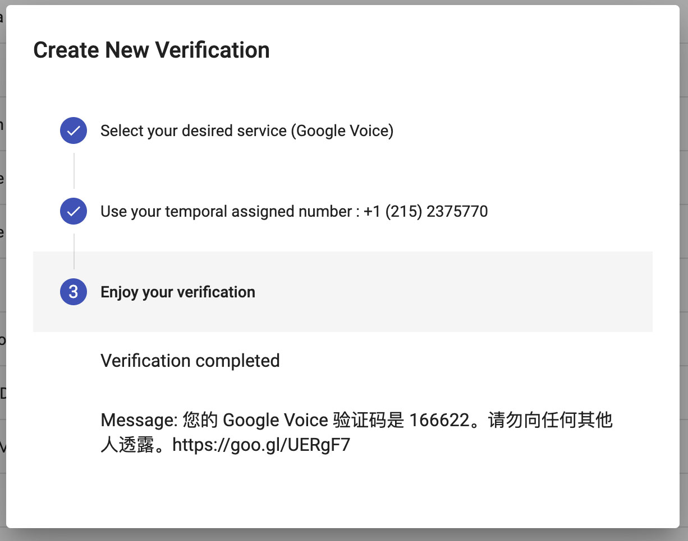

# 2020 年最新注册 Google Voice 号码，成功率极高

## Google Voice 在中国大陆常用功能

* 注册美区 PayPal，绑定 Facebook、Twitter、WhatApp…
* 注册 Telegram，解决 +86 号码不能私聊问题`（+86 可以通过发消息给机器人解锁，考虑到隐私还是不建议大家使用 +86 注册）`。
* 绑定微信（不能注册）。
* 免费拨打 `美国` `加拿大` 电话和收发短信。

## 前期准备

1. Google 账号
2. 美国原生 IP
3. 可以接收美国短信的手机卡（如没有，请看 `步骤三`）

> 存在的风险请自行承担，例如：被 Google 检测出来使用代理，Google 账号可能被封，所以 `步骤一` 很重要。

## 步骤一、检测 IP

* 路线切换为 `美国`（全局模式）；DNS 改为 `8.8.8.8`。

* 浏览器 `无痕模式` 打开 [https://whoer.net](https://whoer.net)，检测路线是否被 Google 识别出来。
  
  > 百分比越高越好，不足地方会列出，如低于 `70%` 建议更换路线

* 打开 [https://ipdata.co/](https://ipdata.co/)，测试路线为 `家庭` 或 `托管`。

> * 显示 `type: "isp"` 表示家庭用户，最佳；
> * 显示 `type: "hosting"` 表示代理托管，建议更换路线。

## 步骤二、挑选 Google Voice 号码

* 打开 [Google Voice](https://voice.google.com/) 使用 Google 账户登陆，点击「选择电话号码」。

* 系统会推荐 Google Voice 号码，找到自己喜欢的点击「选择」。

* 点击「验证」，输入美国号码，点击「发送代码」。

> 没有实体卡，继续往下看 `步骤三`。

## 步骤三、代收短信

* 打开 [https://verifywithsms.com/](https://verifywithsms.com/)，注册并登陆。

* 预先充值 2.1 美元。

* 点击左侧「CATALOG」，找到「Google Voice」，点击后面的购物车，支付 2.09 美元。

* 支付完会显示一个 `美国号码`，复制粘贴到 `步骤二` 输入美国号码处，并点击发送代码。
* 等待几秒，此处会收到 `验证码`，再复制粘贴到 `步骤二` 处。

* 号码已绑定在 Google 账户下，注册完成。

* 手机端安装 Voice 或 Hangouts（环聊）。
  
  > iPhone 切换至美区 App Store 安装 App。

## 为什么建议使用 Google 环聊？

> Google Voice App 须绑定美国真实手机号后才能拨打电话，推荐使用 Google Hangouts（环聊），可以绕过限制。
> 
> 使用 `环聊` 前需要先关联 `Google Voice`

* 登陆 [Google 环聊](https://hangouts.google.com/?authuser=2)，点击`…` 设置，勾选 Google 语音。

* 打开 Google Voice，选择「是的，使用环聊」。

* 点击右上角设置 > 环聊，即可看到已经关联成功。

### Google Voice App 提示：「还有一件事…拨打电话前，请验证您自己的电话号码」

- 打开 Google Voice，点击左上角三条杠 > 设置。
- 通话里点击「拨打和接听电话」。

* 选择「首选 Wi-Fi 和移动数据网络」，此时即可拨打电话了。

## 如何防止 Google Voice 被收回？

> 9 个月内既没有拨出电话或收到来电，也没有发送或收到短信，则 Google 会收回该号码。

* 找位拥有 Google Voice 的朋友互相电话 / 短信，约半年一次即可。
* 拨打美国客服电话，例如 Apple，Microsoft。
* 也可以注册两个 Google Voice 号，互相骚扰 。

## Google Voice 通话资费

* 中国-手机/有线电话：0.02美元/分钟

* 中国-香港手机/固定电话：0.03美元/分钟

* 更多国家资费官网介绍：[https://voice.google.com/u/0/rates?pli=1](https://voice.google.com/u/0/rates?pli=1)
