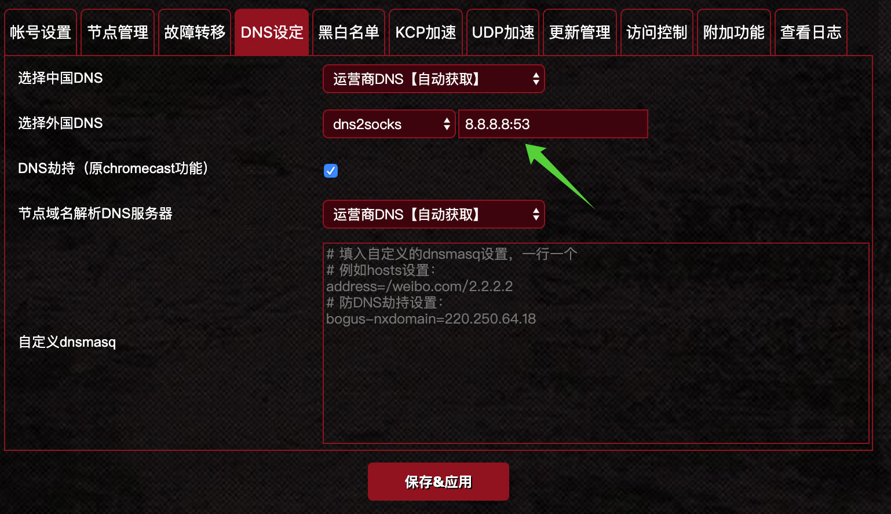
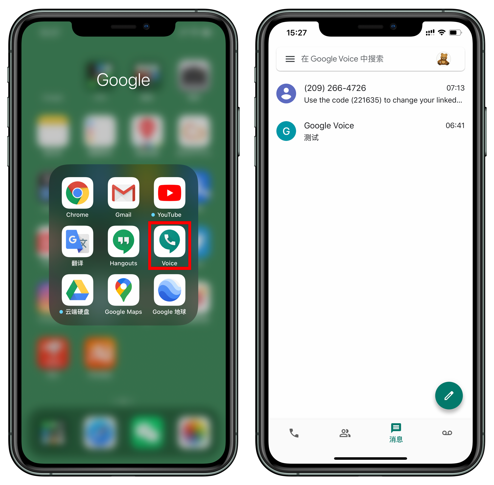

# 2020 年最新注册 Google Voice 号码，成功率极高

## Google Voice 是什么？
* Google 提供给你的免费美国电话号码。

## Google Voice 在中国大陆使用有哪些功能？
* 接受验证码，例如注册美区 PayPal。
* 绑定国内微信或者不想经常收到垃圾短信的平台，解决隐私问题。
* 语音信箱和电子邮件一样，把内容传译成文字。
* 拨打美国和加拿大电话短信均免费，并提供非常便宜的国际长途电话。
* 拦截你不想接听的电话，让它直接进语音信箱。
* 可以在线录音及保存通话。

## 前期准备

1. Google 账号
2. 美国原生 IP
3. 可以接收美国短信的手机卡（如没有，请看步骤三）

## 步骤一、检查 IP
* 路线切换为美国，设置为全局模式；
`DNS` 设置为 `8.8.8.8`。

* 打开 [https://whoer.net](https://whoer.net)，会自动检测美国路线是否存在被谷歌检测出来；
* 分数越高越好，如低于 `70` 分建议更换路线。

* 打开 [https://ipdata.co/](https://ipdata.co/)，看到显示 `isp` 表示家庭用户，如不是建议更换路线。

## 步骤二、登陆 Google 账号
* 浏览器设置为 `无痕模式`；
* 打开 Google 搜索「Google Voice」并登陆 Google 账户，点击「选择电话号码」。

* 系统会自动推荐一些 Google Voice 号码，找到一个自己喜欢的，点击「选择」。

* 点击「验证」，输入可以接受短信的美国号码，点击「发送代码」。

> 如果你没有实体卡，继续往下看。

## 步骤三、代收短信
* 打开 [https://verifywithsms.com/](https://verifywithsms.com/) 并完成注册。

* 使用 PayPal 预先充值 2.1 美元。

* 点击左侧「CATALOG」，找到「Google Voice」，点击后面的购物车，支付 2.09 美元。

* 支付完会看到一个美国号码，复制粘贴到 `步骤二` 输入手机号那里，并点击发送代码。
* 等待几秒，这里会收到 `验证码`。
* 再把 `验证码` 输入到 `步骤二` 那里。

* 完成注册，可以看到号码已经绑定在你的 Google 账户下。

* 手机端安装 Voice 或者 Hangouts，即可接打电话和收发短信。

> iPhone 在美区 App Store 里安装 App。

